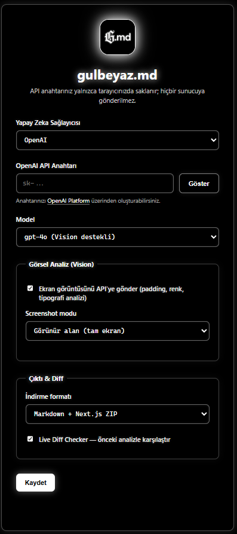

<p align="center">
  
</p>

<h1 align="center">gulbeyaz.md</h1>

<p align="center">
  Chrome eklentisi — Herhangi bir web sayfasını Vision AI ile analiz et, önceki analizlerle karşılaştır ve tek tıkla çalışır bir Next.js proje iskeleti indir.
</p>

---

## Önizleme

<p align="center">
  
</p>

---

## Özellikler

- **Vision AI Analizi** — Sayfanın ekran görüntüsünü (tam ekran veya seçili alan) OpenAI / Gemini modeline göndererek padding, renk paleti ve tipografi çıkarımı yapar.
- **DOM & Tech Stack Tespiti** — React, Next.js, Vue, Angular, WordPress, Shopify ve daha fazlasını sayfadan otomatik algılar.
- **Live Diff Checker** — Aynı sayfayı farklı zamanlarda analiz ettiğinde teknoloji, script ve DOM değişikliklerini raporlar.
- **Markdown Çıktısı** — Proje mimarisi, bağımlılıklar, pseudo-kod ve "Süper Prompt" içeren detaylı bir `.md` dosyası üretir.
- **Next.js ZIP Scaffold** — AI çıktısından dosyaları ayrıştırarak çalışır bir Next.js + Tailwind + shadcn/ui proje iskeletini ZIP olarak indirir.
- **Çift Sağlayıcı Desteği** — OpenAI (GPT-4o, GPT-4o-mini) ve Google Gemini (2.5 Pro/Flash, 1.5 Pro/Flash) desteklenir.

---

## Kurulum

Chrome'a yüklemek için hazır bir `.crx` paketi yoktur; eklentiyi **geliştirici modu** ile yüklemeniz gerekir.

1. Bu repoyu klonlayın veya ZIP olarak indirin.
2. Chrome adres çubuğuna `chrome://extensions` yazın.
3. Sağ üstten **Geliştirici modu**nu açın.
4. **Paketlenmemiş öğe yükle** butonuna tıklayın ve repo klasörünü seçin.
5. Eklenti araç çubuğunuzda görünecektir.

---

## Kullanım

1. Eklenti ikonuna tıklayarak **Ayarlar** sayfasını açın.
2. AI sağlayıcınızı (OpenAI veya Gemini) ve API anahtarınızı girin.
3. Model, screenshot modu ve çıktı formatını seçin → **Kaydet**.
4. Analiz etmek istediğiniz sayfada **sağ tık → Create .md Analysis** yapın.
5. Analiz tamamlandığında seçtiğiniz format otomatik olarak indirilir.

> **Not:** API anahtarınız yalnızca tarayıcınızda (`chrome.storage.sync`) saklanır; hiçbir sunucuya gönderilmez.

---

## Dosya Yapısı

```
├── manifest.json          # Eklenti tanım dosyası (MV3)
├── background.js          # Service worker — ana iş akışı
├── content.js             # Sayfaya enjekte edilen analiz scripti
├── overlay.js             # Analiz sırasında gösterilen modal UI
├── selection.js           # Sürükle-bırak alan seçici
├── options.html/js/css    # Ayarlar sayfası
├── lib/
│   └── jszip.min.js       # ZIP oluşturma kütüphanesi
└── utils/
    ├── diff.js            # İki analiz anlık görüntüsü arasındaki fark hesabı
    └── scaffold.js        # Markdown → Next.js proje dosyaları ayrıştırıcı
```

---

## Desteklenen Modeller

| Sağlayıcı | Model | Vision |
|-----------|-------|--------|
| OpenAI | gpt-4o | ✅ |
| OpenAI | gpt-4o-mini | ✅ |
| OpenAI | gpt-4-turbo | ❌ |
| Gemini | gemini-2.5-pro | ✅ |
| Gemini | gemini-2.5-flash | ✅ |
| Gemini | gemini-1.5-pro | ✅ |
| Gemini | gemini-1.5-flash | ✅ |

---

## API Anahtarı Nereden Alınır?

- **OpenAI:** [platform.openai.com/api-keys](https://platform.openai.com/api-keys)
- **Google Gemini:** [aistudio.google.com/app/apikey](https://aistudio.google.com/app/apikey)

---

## Gereksinimler

- Google Chrome 116+
- Geçerli bir OpenAI veya Google Gemini API anahtarı

---

## Lisans

MIT
